# Safet Admin :bus:

<!--- Replace <OWNER> with your Github Username and <REPOSITORY> with the name of your repository. -->
<!--- You can find both of these in the url bar when you open your repository in github. -->
<!--  -->

## :scroll: Description

<!--- Describe your app in one or two sentences -->

Admin app for Safet. An android system that forms part of the bus tracker system (Safet)that helps to keep your kids safe in the school bus either to or from school. This application helps the school adminstration interact with the system It also just recently helps the drivers also interact with the system

<!--## :bulb: Motivation and Context

Motivation for the project here-->

## :camera_flash: Screenshots

<!-- You can add more screenshots here if you like -->
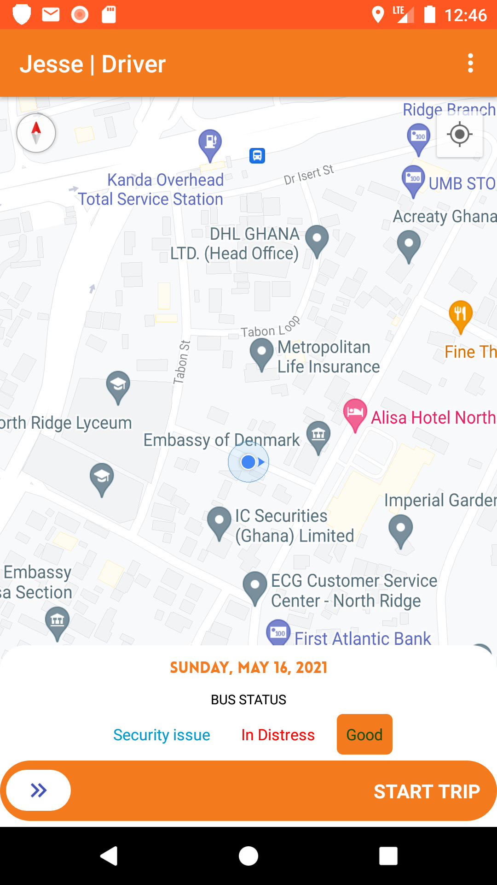&emsp; 
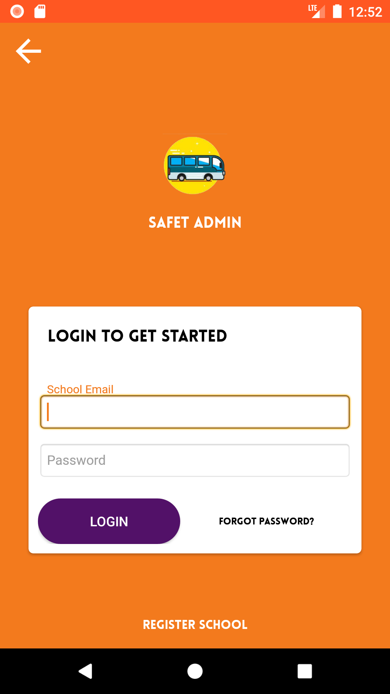&emsp;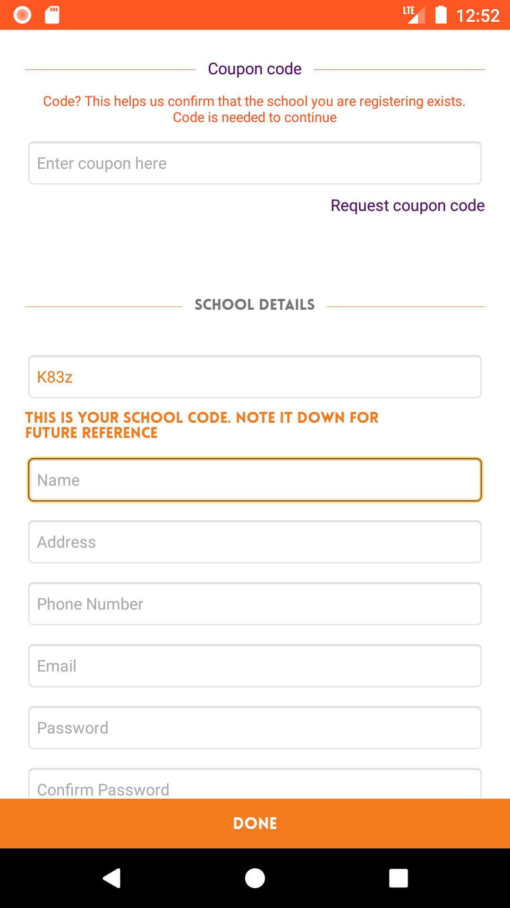 
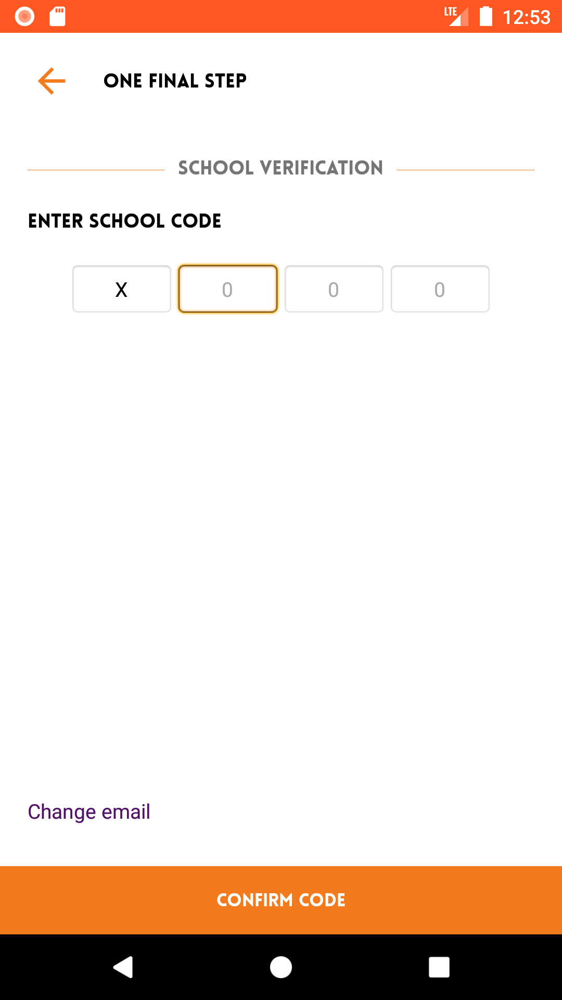&emsp;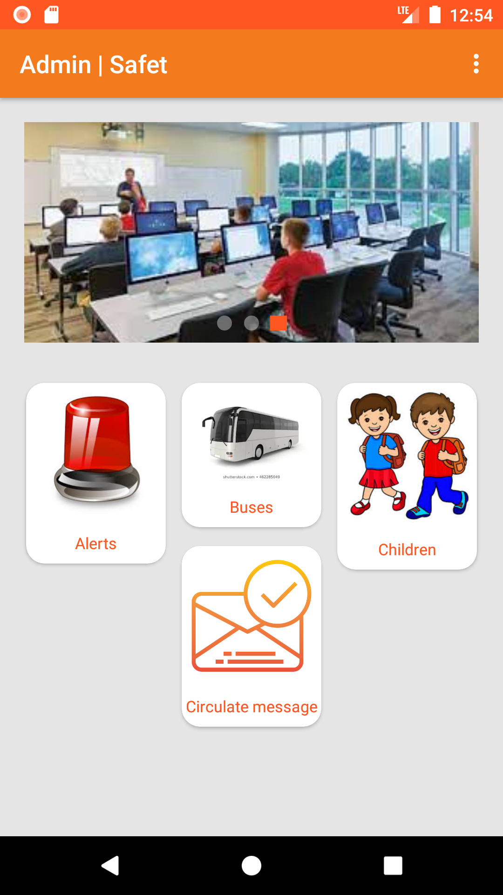 
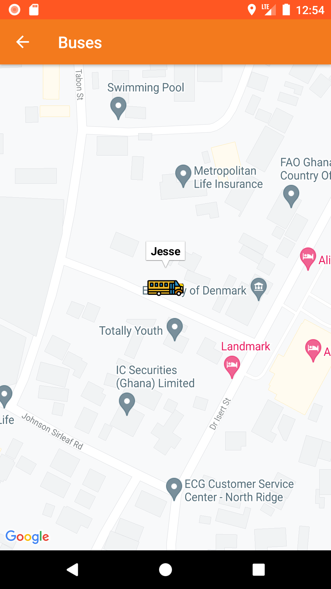&emsp;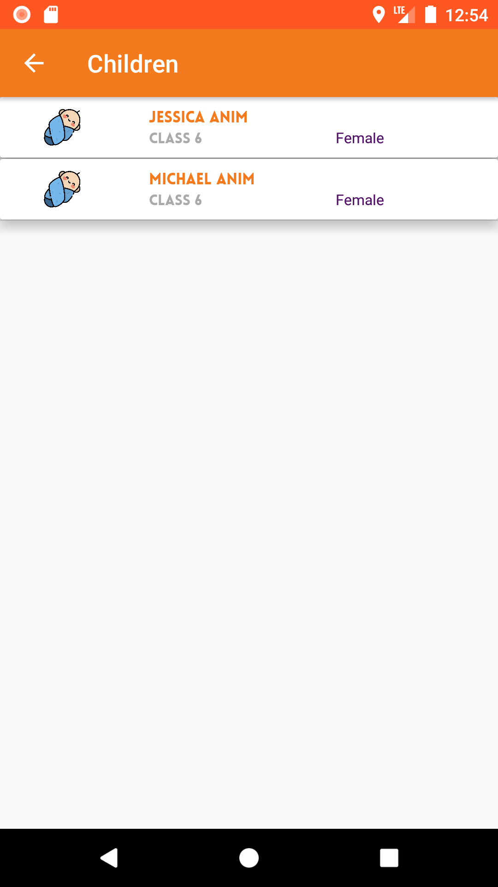 
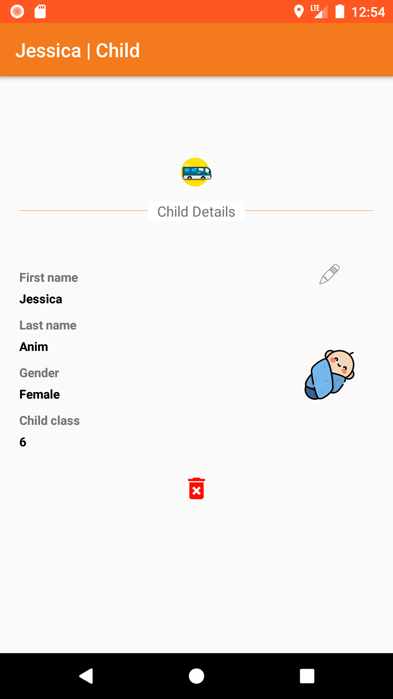&emsp;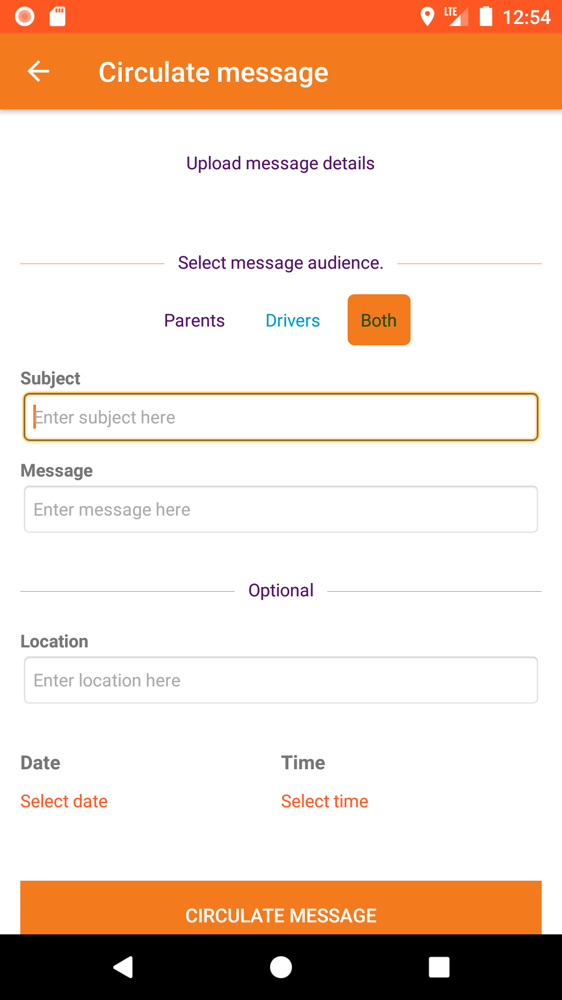 
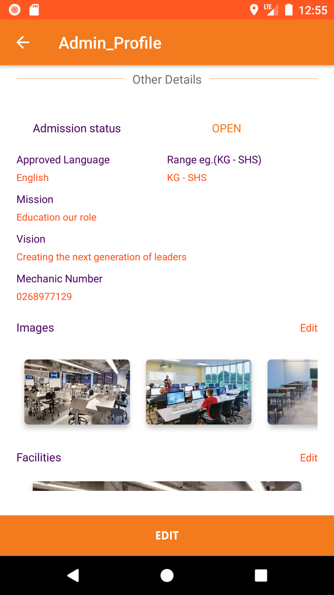&emsp;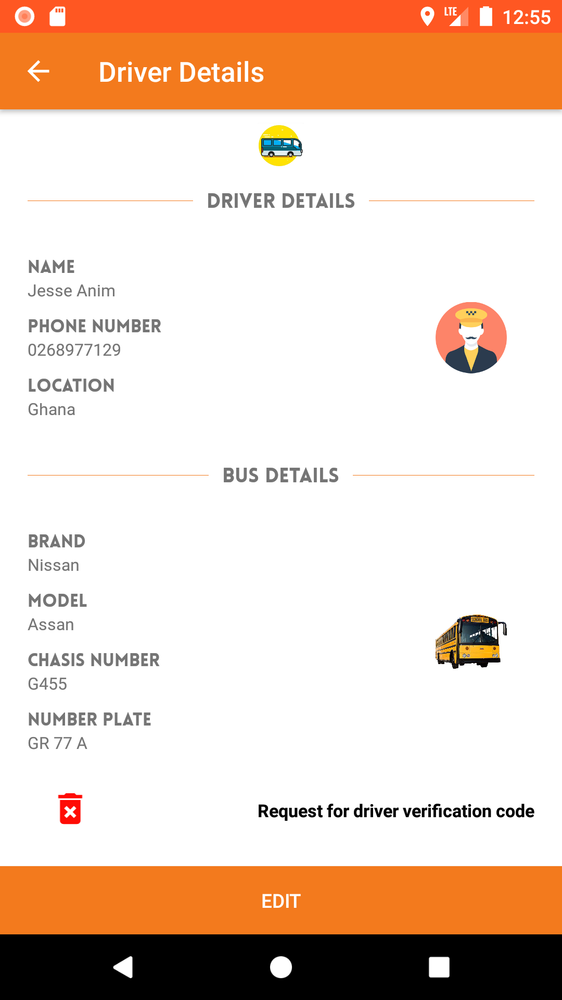 
&emsp;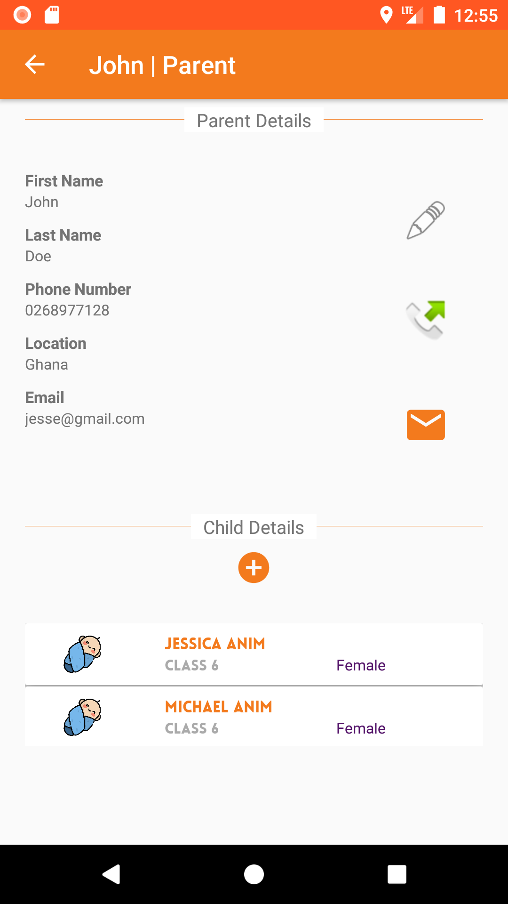 
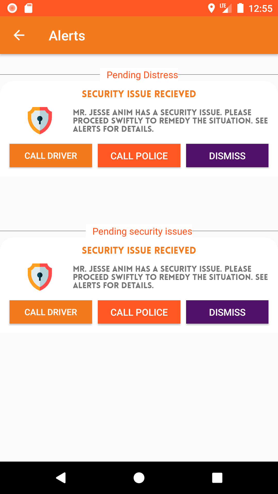

## :file_folder: Repo Walkthrough

The repository contains native android application folders used for the project. 

- Admin (The admin has two user modes, driver and school admin.)

## License

```
(The MIT License)

Copyright (c) 2021

Permission is hereby granted, free of charge, to any person obtaining
a copy of this software and associated documentation files (the
'Software'), to deal in the Software without restriction, including
without limitation the rights to use, copy, modify, merge, publish,
distribute, sublicense, and/or sell copies of the Software, and to
permit persons to whom the Software is furnished to do so, subject to
the following conditions:

The above copyright notice and this permission notice shall be
included in all copies or substantial portions of the Software.

THE SOFTWARE IS PROVIDED 'AS IS', WITHOUT WARRANTY OF ANY KIND,
EXPRESS OR IMPLIED, INCLUDING BUT NOT LIMITED TO THE WARRANTIES OF
MERCHANTABILITY, FITNESS FOR A PARTICULAR PURPOSE AND NONINFRINGEMENT.
IN NO EVENT SHALL THE AUTHORS OR COPYRIGHT HOLDERS BE LIABLE FOR ANY
CLAIM, DAMAGES OR OTHER LIABILITY, WHETHER IN AN ACTION OF CONTRACT,
TORT OR OTHERWISE, ARISING FROM, OUT OF OR IN CONNECTION WITH THE
SOFTWARE OR THE USE OR OTHER DEALINGS IN THE SOFTWARE.
```
    
